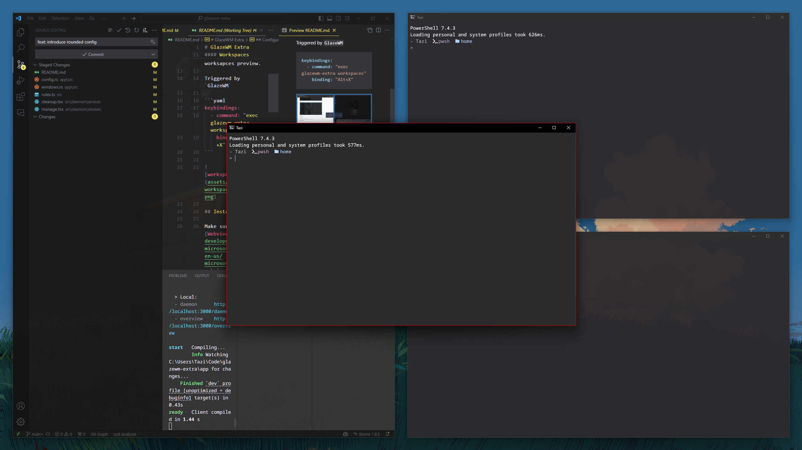

# GlazeWM Extra

Additional features for the Glaze Window Manager (glazewm). 

#### Translucent windows


#### Hide Title Bar


#### Disable Rounded Corner


## Installation

Make sure [VCRuntime140](https://www.microsoft.com/en-us/download/details.aspx?id=48145) is installed before running.

#### Direct Download
The latest build can be found [here](https://github.com/ptazithos/glazewm-extra/releases/).  

#### Scoop

```cmd
scoop install https://github.com/ptazithos/glazewm-extra/releases/latest/download/glazewm-extra.json
```

#### Cargo

```cmd
cargo install glazewm-extra
```

## Configuration
The config file is at `~/.config/glazewm-extra.toml`. The default config is as follows:

```toml
# Rules are applied to every window once it is created.
[[window_rules]]
command = "set title false"
match_process_name = ".*"

[[window_rules]]
command = "set rounded false"
match_process_name = ".*"

# Rules are applied to the focused window when the focus changes.
[[focused_window_rules]]
command = "set translucent 255"
match_process_name = ".*"

# Rules are applied to the unfocused windows when the focus changes.
[[unfocused_window_rules]]
command = "set translucent 220"
match_process_name = ".*"
```
Except `match_process_name`, `match_class_name` and `match_title` are also available.

## License

This repository is licensed under the [MIT License](LICENSE).


