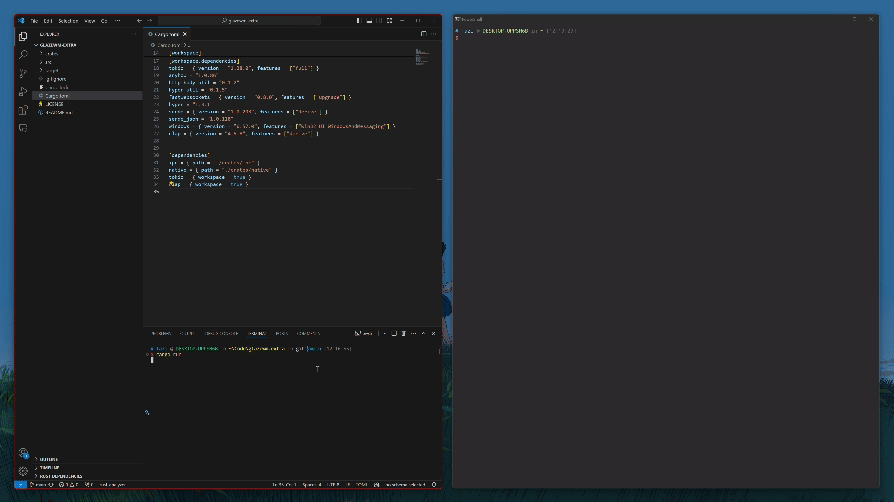
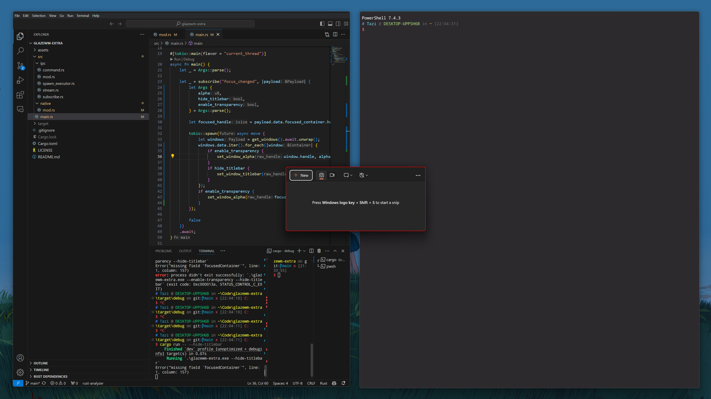
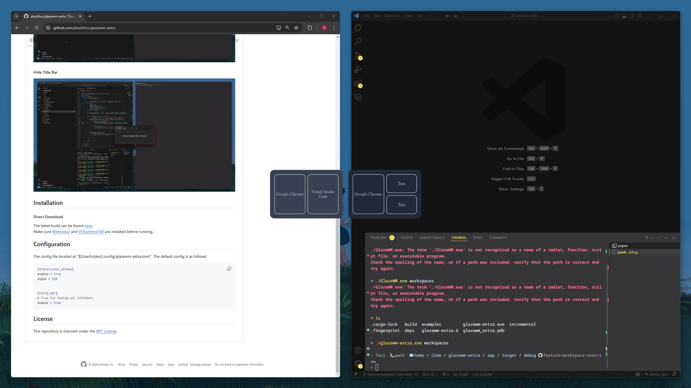

# GlazeWM Extra

Additional features for the Glaze Window Manager (glazewm). 

#### Translucent windows


#### Hide Title Bar


#### Workspaces Preview
After glazewm-extra starts, run `glazewm-extra.exe workspaces` to trigger the worksapces preview.

Triggered by `GlazeWM`

```yaml
keybindings:
  - command: "exec glazewm-extra workspaces"
    binding: "Alt+X"
```



## Installation

Make sure [Webview2](https://developer.microsoft.com/en-us/microsoft-edge/webview2) and [VCRuntime140](https://www.microsoft.com/en-us/download/details.aspx?id=48145) are installed before running.

#### Direct Download
The latest build can be found [here](https://github.com/ptazithos/glazewm-extra/releases/).  

#### Scoop

```cmd
scoop install https://github.com/ptazithos/glazewm-extra/releases/download/v0.1.4/glazewm-extra.json
```

## Configuration
The config file located at "${UserFolder}/.config/glazewm-extra.toml". The default config is as follows:

```toml
[[window_rules]]
command = "set title false"
match_process_name = ".*"

[[focused_window_rules]]
command = "set translucent 255"
match_process_name = ".*"

[[unfocused_window_rules]]
command = "set translucent 220"
match_process_name = ".*"
```

## License

This repository is licensed under the [MIT License](LICENSE).


